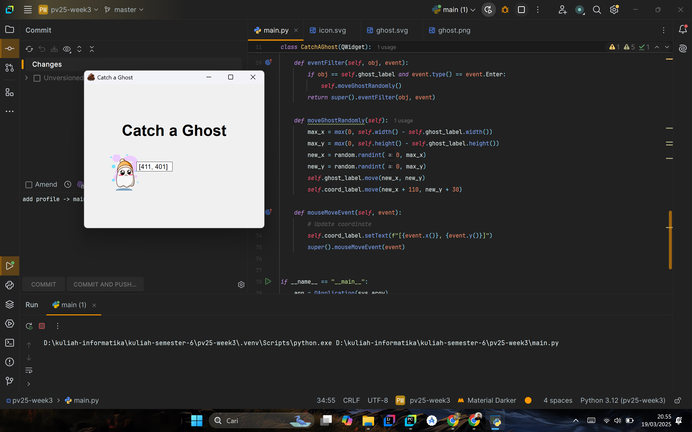

## Data Diri

```plaintext
| Nama Lengkap         | NIM        |
|----------------------|------------|
| M ILHAM ABDUL SHALEH | F1D022061  |
```


# Catch a Ghost - PyQt5 Game

## Deskripsi
**Catch a Ghost** adalah sebuah aplikasi berbasis **PyQt5** yang menampilkan permainan sederhana di mana pengguna harus menangkap hantu yang bergerak secara acak saat disentuh. Aplikasi ini juga menampilkan koordinat kursor pengguna dalam jendela aplikasi.

### Fitur Utama:
- Menampilkan label yang menunjukkan koordinat kursor secara real-time.
- Jika kursor melayang di atas hantu, hantu akan berpindah ke posisi acak.
- Menggunakan **event handling PyQt5** untuk mendeteksi pergerakan mouse dan event hover.

## Requirement
Sebelum menjalankan aplikasi, pastikan sistem Anda telah menginstal **Python 3** dan modul berikut:

```bash
pip install PyQt5
```

## Cara Menjalankan
1. Pastikan Anda memiliki **Python 3** terinstal.
2. Instal **PyQt5** jika belum terpasang.
3. Jalankan skrip menggunakan perintah berikut:

```bash
python main.py
```

## Struktur Direktori
```plaintext
CatchAGhost/
│-- main.py
│-- asset/
│   │-- icon.svg
│   │-- ghost.svg
│   │-- capture.png  # Screenshot hasil running aplikasi
│-- README.md
```

## Hasil Running Aplikasi
Berikut adalah tampilan saat aplikasi dijalankan:




---
Aplikasi ini dibuat sebagai bagian dari latihan menggunakan PyQt5.

